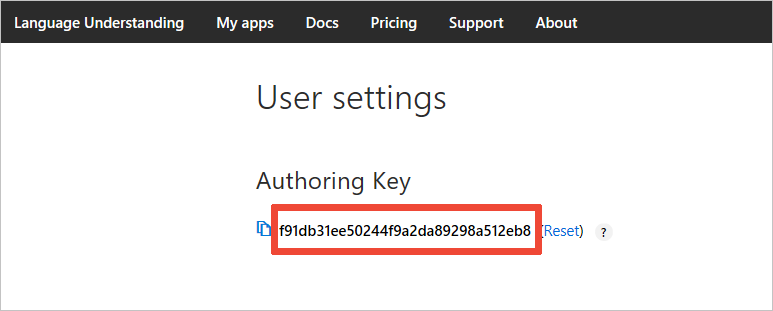

# Cognitive Services: LUIS Runtime Sample

A example demonstrating how:
- to consume the LUIS Authoring SDK to build an app or manage it
- to consume the LUIS Runtime SDK to predict user utterances.

## Prerequisites

The minimum prerequisites to run this sample are:
* A [LUIS.ai account](https://www.luis.ai/) where to upload the sample's LUIS model.

The first step is to get your Authoring Key. Go to the home page, [www.luis.ai](https://www.luis.ai/), and log in. After creating your LUIS account, a starter key, also known as a Authoring key, is created automatically for LUIS account. To find the authoring key, click on the account name in the upper-right navigation bar to open [Account Settings](https://www.luis.ai/user/settings), which displays the Authoring Key.



Set the `LUIS_SUBSCRIPTION_KEY` environment variable to this authoring key to continue.

## Cognitive Services: LUIS Authoring Sample

We provide two samples:

- The booking sample who is a complete example on how to create an app, create intents, utterances, training and publishing the app
- The management example shows management operations: import or export an app/version, listing the different versions of an app, cloning a version, etc.

## Cognitive Services: LUIS Runtime Sample

#### LUIS Application

The first step to using LUIS is to create or import an application. Go to the home page, [www.luis.ai](https://www.luis.ai/), and log in. After creating your LUIS account you'll be able to Import an Existing Application where can you can select a local copy of the LuisApp.json file an import it.


If you want to test this sample, you have to import the pre-build [LuisApp.json](LuisApp.json) file to your LUIS account.

Once you imported the application you'll need to "train" the model ([Training](https://docs.microsoft.com/en-us/azure/cognitive-services/luis/train-test)) before you can "Publish" the model in an HTTP endpoint. For more information, take a look at [Publishing a Model](https://docs.microsoft.com/en-us/azure/cognitive-services/luis/publishapp).

Finally, edit the [luisRuntime.js](luisRuntime.js) file and update the attribute placeholders with the values corresponding to your Application and Azure Region where the application was deployed.

#### Where to find the Application ID and Subscription Key

You'll need these two values to configure the LuisDialog through the LuisModel attribute:

1. Application ID

    You can find the App ID in the LUIS application's settings.

    

2. Subscription Key and Azure Region

    Click on the Publish App link from the top of the LUIS application dashboard. Once your app is published, copy the Region and Key String from *Starter_Key* from the Endpoints table on the Publish App page.

    


### Code Highlights

One of the key problems in human-computer interactions is the ability of the computer to understand what a person wants, and to find the pieces of information that are relevant to their intent. In the LUIS application, you will bundle together the intents and entities that are important to your task. Read more about [Planning an Application](https://docs.microsoft.com/en-us/azure/cognitive-services/luis/plan-your-app) in the [LUIS Docs](https://docs.microsoft.com/en-us/azure/cognitive-services/luis/).

Once your model is set, you can invoke the LUIS Runtime API to analyze user input and obtain its intent and possible entities.

From NPM, use the [azure-cognitiveservices-luis-authoring](https://www.npmjs.com/package/azure-cognitiveservices-luis-authoring) and  [azure-cognitiveservices-luis-runtime](https://www.npmjs.com/package/azure-cognitiveservices-luis-runtime)  packages.

````javascript
const CognitiveServicesCredentials = require('ms-rest-azure').CognitiveServicesCredentials;
const LUISRuntimeClient = require("azure-cognitiveservices-luis-runtime");

// Create client with SubscriptionKey and Azure region
const credentials = new CognitiveServicesCredentials(subscriptionKey);
const client = new LUISRuntimeClient(credentials, "https://westus.api.cognitive.microsoft.com")

// Predict
const result = await client.prediction.resolve("[LUIS_APPLICATION_ID]", "Text to Predict or User input")
````

The LuisResult object contains the possible detected intents and entities that could be extracted from the input.

### Outcome

You will see the following when running the application:

```
Executing query: find flights in economy to Madrid
Detected intent: FindFlight (score: 95.57%)
Detected entities:
	-> Entity 'economy' (type: Class, score: 85.95%)
	-> Entity 'madrid' (type: Destination, score: 89.44%)
	-> Entity 'economy to madrid' (type: Flight, score: 81.03%)
Complete result object as dictionary
{"query":"find flights in economy to Madrid","topScoringIntent":{"intent":"FindFlight","score":0.9557334},"entities":[{"entity":"economy","type":"Class","startIndex":16,"endIndex":22,"score":0.8595318},{"entity":"madrid","type":"Destination","startIndex":27,"endIndex":32,"score":0.8943938},{"entity":"economy to madrid","type":"Flight","startIndex":16,"endIndex":32,"score":0.8102929}],"compositeEntities":[{"parentType":"Flight","value":"economy to madrid","children":[{"type":"Class","value":"economy"},{"type":"Destination","value":"madrid"}]}]}
```

### More Information

To get more information about how to get started in Bot Builder for .NET and Conversations please review the following resources:
* [Language Understanding Intelligent Service](https://azure.microsoft.com/en-us/services/cognitive-services/language-understanding-intelligent-service/)
* [LUIS.ai](https://www.luis.ai)
* [LUIS Docs](https://docs.microsoft.com/en-us/azure/cognitive-services/luis/home)
* [LUIS Runtime API v2 - Specification](https://github.com/Azure/azure-rest-api-specs/tree/current/specification/cognitiveservices/data-plane/LUIS/Runtime)